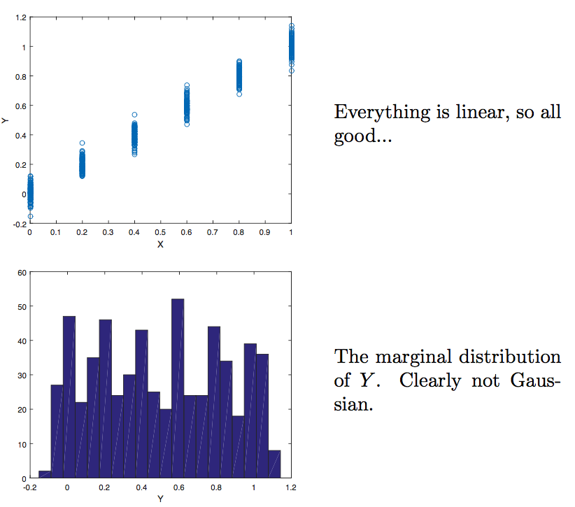

In statistics we have two types of variables.

Categorical data:
* Left or Right
* Male or Female
* Which city is a person born?

This can be divided into two groups
* Ordinal Categorical: (Where the ranking matters):
For example Masters level is higher then bachelors level.
* Nominal Categorical:
For example eye color or gender (One is not "better" then the other.)

In total data where it doesn't make sense to add (Left is not double of right), Where someone is born can not be represented by a number.

Continuous data
* Age
* Income

Any data where it makes sense add and subtract and so on (double the age of a person is the double of the age)

A problem is for example when someone if born. If I was born 1993 and someone else is born in 996 they are not double the age of me.

So and a better solution is to convert this to age (current year - year of birth)

## What is the relationship between the dependent variable and the independent variable?

According to the assumptions in a Linear model $E(Y)=\alpha + \beta X$.

But if lineasrity between Y and X does not hold we might be able to transform Y and/or X so the relationship becomes linear. For example $E(Y)=\alpha + \beta \cdot log(X)$

This is still a linear model, because of the linearity in the parameters ($\alpha$ and $\beta$)

This means that by plotting an histogram of the response variable Y dosnt have to be normally distributed because the assumption is that the $\epsilon_i \sim N(0,\sigma^2) \rightarrow Y_i \sim N(\alpha+\beta X_i,\sigma^2)$. So if we plot each Y_i (If we have enough data points then we should get a gaussian distribution.)

The linear regression and multivariable regression proof is done by the least square where the goal is to minimize the error term $(\sum\epsilon^2_i=\sum(Y_i-\hat{Y_i})^2)$

The proof is [here](proofls)

Next up [linearregression/](Linear regression):
