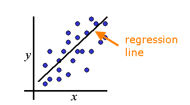
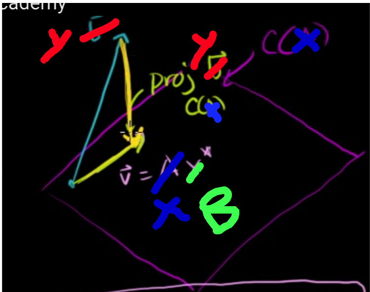

##Hello!

Fist a simple linear regression is just \\(Y = \alpha + \beta X \\). Where you try to fit a linear line to find pattern i data.

From a numerical mathematical stand point this is kinda simple but from a statistical stand point there is a lot of complicated terms that we need to get threw.

We start by the numerical and "easy" way.

If have some data points in two dimensions \\( (x_1,y_1),(x_2,y_2),...(x_n,y_n)\\). And we want to find a straight line that tries to go therw these points as good as possible like this:

If we try to figure out how to get this line we get a system of linear equation (read matrix multiplication).

\\[\begin{cases} \alpha + \beta x_1 = y_1 \\\\ \alpha + \beta x_2 = y_2 \\\\ \alpha + \beta x_3 = y_3 \end{cases}\\]

We can rewrite this as a matrix:
\\[
\begin{equation}
\begin{bmatrix}
1 & x_{1} \\\\ 1 & x_{2} \\\\ 1 & x_{3} \\\\ 1 & x_{4} \\\\ \vdots &\vdots
\end{bmatrix}\begin{bmatrix}
\alpha \\\\ \beta \\\\
\end{bmatrix}=\begin{bmatrix}
y_1\\\\ y_2\\\\
y_3\\\\y_4 \\\\ \vdots
\end{bmatrix}
\end{equation}
\\]
As we see in the picture above so does not this equation have a solution. (If it did it all the dots would have to be lined up perfectly).

So instead we try to draw a line the fits the dots as good as possible. The numerical name for simple linear regression is "least squares" which means that you try to minimize \\(\sum(\hat{y_{i}}-y_i)\\)
where \\(y_i\\) is the true value and \\(\hat{y}_i\\) is the predicted value or the y value one predicted line for the specified \\(x_i\\)

The numerical proof of this is the following:
This example is taken from a great video from khan academy [link](https://www.khanacademy.org/math/linear-algebra/alternate-bases/orthogonal-projections/v/linear-algebra-least-squares-approximation)
From the matrix equation above we have \\(X\beta=Y\\). This equation doesn't have a solution so the next best thing is to use
\\[X\hat{\beta} = Y\\] where \\(\hat{\beta}\\) is the coefficients for the least square solutions.

A side note is that we use \\(\hat{\beta}\\) to be extra clear, in general they are the same thing.)

If we look at the picture below we see the purple plane. This is the solution space of A or X in our case. This means the space where X has a solution for given \\(\beta\\). As mentioned before our equation does not have a solution but the next best thing is projection of y on the solution space.
We get that:
\\[X\hat{\beta}=\text{proj}_{Y}C(X)\\]
or to make the picture more clear:
\\[X\hat{\beta}=\bar{v}=\text{proj}_{Y}C(X)\\]

If we take -Y on both sides we get \\[X\beta-Y=\text{proj}_{Y}C(X)-Y\\]
We see that \\(text{proj}_{Y}C(X)-Y \in C(A)^{\bot}\\).
\newline
And we know that the complement of the column space is the null space of the \\(A\\). (The compliment of the span of the column vectors is the null space of A)
\\[Col(A)^\bot = Null(A)\\]
so the complement of the row space is (solution space of A is the col(A))
\\[row(A)^\bot=N(A^T)\\] or the null space of the transpose of A.
\newline
So we get:
\\[X^T(X\beta-Y)=\bar{0}\\]
\\[X^TX\beta-X^TY=\bar{0}\\]
\\[X^TX\beta=X^TY\\]
\\[\beta=(X^TX)^{-1}X^{T}Y\\]

This is was the easy way.

## The statistical way
The statistical way is a bit more confusing but more mathematical correct. From my point of view the numerical way just calculates the best line but in statistics they explane why.

So the statistical point of view is that \\(Y_i\\) is a [random variable](datascience/statistics/index.md) (check this link always) with distribution \\(Y_i \sim N(\alpha+\beta x_i,\sigma^2) \\). Let this sink in. We assume that for a given \\(x_i\\) we get a random variable \\(Y_i\\. A random variable. Okey.

Another way to write this is \\( y_i = \alpha + \beta x_i + \epsilon \\) where \\(\epsilon \sim N(0,\sigma^2)\\) is the error term.

Note here that the Y is a capital letter and the x is small. This is because Y is a random variable and x is a data point.

Okey now we know this.

### How do we find the best line?

We want to minimize \\( \epsilon \\) or in stastiscal words make the \\(\sigma^2\\) smaller. (if \\(\sigma\\) = 0 then we have a perfect line)

So \\( \epsilon \sim N(0,\sigma^2) \\) how do we find the perfect line jo när \\((y_i-\hat{y}_i)^2\\) is small

bla bla

\\(S_{xx} = \sum (x_i-\bar{x})^2\\)
\\(S_{xy} = \sum (x_i-\bar{x})(y_i-\bar{y})\\)

\\(\beta = \frac{S_{xy}}{S_{xx}}\\)
\\(\alpha = \bar{y}-\beta\bar{x}\\)

# Overkill

### What is the distributions of alpha and beta
\\(\alpha \text{ and } \beta\\)?

\\(\alpha = \bar{y}-\frac{S_{xy}}{S_{xx}}\bar{x}\\)

Why is \\(\alpha \text{and} \beta\\) normally distributed?

We know that \\(\sum{(x_i-\bar{x})}\\) and:

\\[
\beta = \frac{S_{xy}}{S_{xx}}
\\]
\\[= \frac{\sum(x_i-\bar{x})(y_i-\bar{y})}{S_{xx}}
\\]

\\[= \frac{\sum(x_i-\bar{x})y_i-\sum(x_i-\bar{x})\bar{y})}{S_{xx}}
\\]

\\[
\frac{\sum(x_i-\bar{x})y_i-\bar{y}\sum(x_i-\bar{x})}{S_{xx}}
\\]

\\[
\frac{\sum(x_i-\bar{x})y_i-\bar{y}\sum(x_i-\bar{x})}{S_{xx}}
\\]

So \\(\beta is normally distributed because y_i is a sample from a normal distribution.\\)

If we do the same thing for \\( \alpha \\)

Kolla boken och kolla share latex 1.2.4.

### How to we find the best line

\\(\\)
